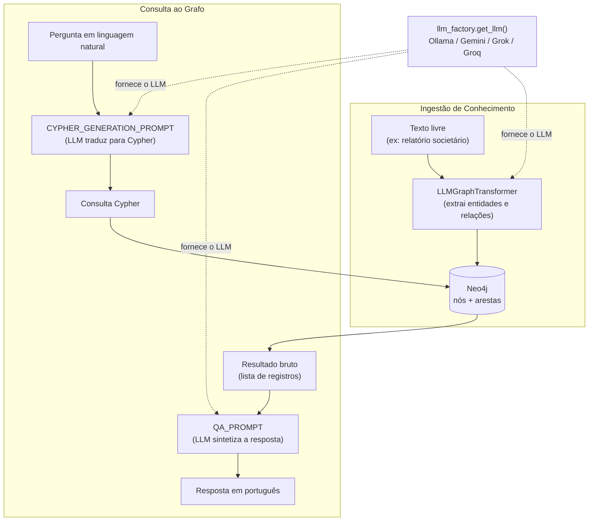

# PRJ-06 — GraphRAG: Explorador de Relações

Sexto projeto de uma progressão de oito técnicas de RAG (PRJ-01 a PRJ-08, orquestradas por um nono projeto de deploy). Troca busca vetorial por um banco de grafo: o conhecimento vira nós e arestas no Neo4j, e as perguntas viram consultas Cypher que navegam relações em vez de comparar embeddings.

## Visão geral

RAG "clássico" (PRJ-01 a PRJ-05, PRJ-07, PRJ-08) responde perguntas recuperando os pedaços de texto mais parecidos com a pergunta, via similaridade vetorial. Isso funciona bem quando a resposta está contida em um trecho contínuo de texto. Falha quando a resposta depende de **relações estruturadas** entre entidades — "quem responde para o CEO e em qual empresa essa pessoa trabalha" não é uma frase que existe em nenhum documento; é o resultado de atravessar duas arestas de um grafo.

O GraphRAG resolve isso em duas etapas:

1. **Ingestão**: texto livre é processado por um LLM (`LLMGraphTransformer`, do `langchain-experimental`), que extrai entidades (pessoas, empresas, projetos) e relações entre elas (`TRABALHA_EM`, `GERENCIA`, `RESPONDE_PARA`...) e grava tudo como nós e arestas no Neo4j.
2. **Consulta**: a pergunta em linguagem natural é traduzida por um LLM em uma consulta Cypher (`GraphCypherQAChain`, do `langchain-neo4j`), que é executada contra o grafo. O resultado bruto (lista de registros) é então sintetizado em uma resposta em português por um segundo passo do mesmo LLM.

Um grafo de conhecimento vale a complexidade extra quando o domínio é naturalmente relacional — estrutura societária, hierarquia organizacional, dependências entre projetos — e a pergunta típica é sobre **como as coisas se conectam**, não sobre **o que foi dito** em algum lugar.

## Funcionalidades

- Extração de entidades e relacionamentos de texto livre para o Neo4j, via `GraphExtractor`.
- Perguntas em linguagem natural traduzidas para Cypher e respondidas com base no resultado real da consulta, via `GraphRetrievalQA`.
- Suporte a quatro providers de LLM intercambiáveis em tempo de execução (Ollama local, Google Gemini, xAI Grok, Groq Cloud), sem qualquer mudança de código.
- Diagnóstico de providers em dois eixos — configurado vs. verificado por chamada real — com classificação automática do motivo da falha.
- Seletor de motor na interface que testa cada provider ao carregar a tela e só oferece os que respondem de verdade.
- Visualização do schema do grafo (rótulos, tipos de relação) diretamente na interface.
- Neo4j isolado (`docker-compose.standalone.yml`) para rodar o projeto sozinho, sem depender do orquestrador do ecossistema.

## Arquitetura



O `graph_engine.py` concentra as duas classes principais: `GraphExtractor` (ingestão) e `GraphRetrievalQA` (consulta). Nenhuma das duas conhece qual provider de LLM está por trás — ambas pedem um `BaseChatModel` pronto à `llm_factory` e o resto do pipeline é idêntico independentemente do motor escolhido.

## Stack tecnológica

| Camada | Tecnologia |
|---|---|
| Interface | Streamlit (`frontend/app.py`) — único front-end deste projeto, sem API própria |
| Extração de grafo | `langchain-experimental` (`LLMGraphTransformer`) |
| Consulta ao grafo | `langchain-neo4j` (`GraphCypherQAChain`, `Neo4jGraph`) |
| Banco de grafo | Neo4j 5.18 (com plugin APOC) |
| Orquestração LLM | LangChain 0.3.x |
| LLM local | Ollama (`langchain-ollama`) |
| LLM em nuvem | Google Gemini (`langchain-google-genai`), xAI Grok (`langchain-xai`), Groq Cloud (`langchain-groq`) |
| Testes | pytest, pytest-asyncio |
| Config | `python-dotenv` |

## Suporte multi-provider de LLM

`src/core/llm_factory.py` é o único ponto do projeto que sabe instanciar uma classe concreta de chat model. Cada SDK é importado sob demanda (`import` dentro da função construtora), então um provider não instalado não derruba os outros. A resolução de provider e modelo segue a mesma ordem de precedência em todo o projeto: argumento explícito no código > variável de ambiente > padrão.

| Provider | Classe | Variável de chave | Modelo padrão |
|---|---|---|---|
| `ollama` | `ChatOllama` (local) | — | `llama3.2:latest` |
| `gemini` | `ChatGoogleGenerativeAI` | `GEMINI_API_KEY` (ou `GOOGLE_API_KEY`) | `gemini-2.5-flash` |
| `grok` | `ChatXAI` (xAI) | `XAI_API_KEY` | `grok-4-latest` |
| `groq` | `ChatGroq` (Groq Cloud) | `GROQ_API_KEY` | `llama-3.3-70b-versatile` |

> **`grok` ≠ `groq`.** xAI Grok e Groq Cloud são empresas diferentes separadas por uma letra, cada uma com SDK e chave próprios. `GROQ_API_KEY` não habilita o Grok nem vice-versa — há teste automatizado (`test_grok_e_groq_nao_se_misturam`, `test_chave_do_groq_nao_habilita_o_grok`) travando exatamente essa confusão.

### Diagnóstico: configurado ≠ funcionando

Ter SDK instalado e chave no `.env` não significa que o provider responde: a conta pode estar sem crédito, a chave pode ter sido revogada, o modelo pode não existir para aquele plano. O diagnóstico separa dois eixos:

- **`available`** — a configuração está completa (SDK importável + chave presente).
- **`verified`** — o resultado de uma chamada real: `None` nunca testado, `True` respondeu, `False` falhou.

Quando uma chamada real falha, `classificar_falha()` traduz a exceção do SDK em uma categoria acionável (`sem_credito`, `chave_invalida`, `limite_taxa`, `modelo_inexistente`, `rede`), verificando assinaturas de texto numa ordem que importa:

- **Limite de taxa é checado antes de "sem crédito"** porque o Google devolve `429` com texto de "quota"/"billing" para um simples limite de requisições por minuto do free tier — sem essa prioridade, isso seria classificado como falta de crédito, e a orientação errada seria comprar crédito quando bastava esperar.
- **"Sem crédito" é checado antes de "chave inválida"** porque a xAI devolve falta de crédito como `403 permission-denied`, formato idêntico ao de uma chave revogada.

Falhas de infraestrutura nunca são atribuídas ao provider de LLM: `falha_e_do_provider()` percorre a cadeia de causas da exceção (`__cause__`/`__context__`) e reconhece módulos como `neo4j`, `redis` ou `chromadb` na origem — um Neo4j fora do ar não pode virar "compre crédito na Groq".

Na interface, o seletor de motor testa cada provider ao carregar a tela (`probe_provider`) e só oferece os que responderam de verdade; motores quebrados somem da lista principal com o aviso "Fora do seletor: X" (visível expandindo "Mostrar motores indisponíveis"). O teste do Ollama consulta `/api/tags` do daemon **sem gerar texto** — carregar um modelo de dezenas de GB só para testar tornaria a abertura da tela inviável — e todos os testes de providers em nuvem rodam com `max_retries=0`, porque esperar o backoff de um `429` do Gemini custava 63 segundos por teste.

### Benchmark: qualidade de resposta por provider/modelo

Bateria de 4 perguntas contra o grafo do seed (`scripts/seed_graph.py`) — uma de 1 salto, duas variações de 2 saltos, e uma sobre entidade inexistente que precisa admitir "não encontrei":

| Provider / Modelo | Resultado | Tempo por pergunta | Observação |
|---|---|---|---|
| Groq — `llama-3.3-70b-versatile` | **4/4** | ~2s | Escolhido como padrão do projeto |
| Ollama — `llama3.2:3b` | 0/4 | rápido, mas errado | Gerava Cypher inválido e sintetizava respostas erradas |
| Ollama — `phi3:latest` | 0/4 | rápido, mas errado | Em um dos casos **inventou uma empresa que não existe no grafo** |
| Ollama — `qwen3.5:35b` | 4/4 | ~168s | Correto, porém inviável para uso interativo nesta máquina |
| Ollama — `deepseek-v3.2:cloud` | não testável | — | Listado no Ollama, mas exige autenticação separada no Ollama Cloud (`Unauthorized`) |

Por isso o padrão do projeto é `LLM_PROVIDER=groq` no `.env`. `phi3:latest` alucinando uma empresa inteira reforça por que o `QA_TEMPLATE` proíbe explicitamente inventar qualquer dado fora do resultado da consulta.

## Correções aplicadas aos prompts de Cypher e de resposta

Os prompts padrão do LangChain (`CYPHER_GENERATION_PROMPT` e `QA_PROMPT` genéricos) não impõem regra nenhuma sobre como buscar entidades ou como interpretar o resultado. Testando contra um grafo populado de verdade, os modelos erravam de formas específicas e repetíveis. `CYPHER_GENERATION_TEMPLATE` e `QA_TEMPLATE`, em `src/core/graph_engine.py`, foram reescritos regra por regra para cada falha observada:

| # | Falha observada | Causa | Correção no prompt |
|---|---|---|---|
| 1 | Truncamento de nome de entidade | "Projeto Alpha" virava busca só por "Alpha" | Regra explícita: usar o nome completo como aparece na pergunta, nunca um fragmento |
| 2 | Igualdade exata na busca | Quebrava com diferença de acento ou nome parcial | Forçar `toLower(x.name) CONTAINS toLower('termo')` em vez de `=` |
| 3 | Alucinação de tipo de relação | O modelo inventava relações fora do schema real do grafo | Regra: usar somente rótulos e tipos de relação que aparecem no `{schema}` injetado no prompt |
| 4 | Resolução errada de pronome em perguntas de 2 saltos | Em "quem responde ao CEO e onde essa pessoa trabalha", "essa pessoa" era ligada ao CEO em vez de a quem responde a ele | Regra explícita: pronomes se referem à entidade que a **primeira parte** da pergunta procura, não à entidade usada como referência |
| 5 | Resultado sem as entidades usadas como filtro | O modelo synthesizer duvidava da própria resposta correta por não ver o que foi filtrado | Regra: retornar também as entidades-filtro na consulta, não só a resposta final |
| 6 | "Não sei" com o dado certo na mão | O resultado chega como lista de dicionários (`[{'p.name': 'Ana'}]`) e o modelo não associava isso a "já tenho a resposta" | `QA_TEMPLATE` deixa explícito: qualquer resultado não vazio é a resposta; só lista vazia justifica "não encontrei" |

O `CYPHER_GENERATION_TEMPLATE` também resolve direção de aresta ambígua caindo para a relação sem seta (`-[:REL]-`) em vez de arriscar `->` ou `<-` errado, e o `QA_TEMPLATE` proíbe frases como "não é possível determinar" quando a consulta já aplicou todos os filtros da pergunta — se há uma linha no resultado, ela já satisfaz a pergunta inteira.

Qualquer alteração nesses dois prompts exige reteste contra a bateria de benchmark em todos os providers — uma regra que corrige um modelo pode não ter efeito, ou até piorar o comportamento, em outro.

## Estrutura de pastas

```
PRJ-06_GraphRAG/
├── frontend/
│   └── app.py                   # Interface Streamlit — único front-end do projeto
├── src/
│   └── core/
│       ├── graph_engine.py      # GraphExtractor, GraphRetrievalQA, prompts de Cypher/QA
│       └── llm_factory.py       # Fábrica multi-provider + diagnóstico de saúde
├── scripts/
│   ├── seed_graph.py            # Popula o Neo4j com um grafo corporativo de exemplo
│   └── verify_llm.py            # CLI de diagnóstico dos providers (com/sem chamada real)
├── tests/
│   ├── test_graph_engine.py     # Pipeline de extração e consulta, seleção de provider
│   ├── test_llm_factory.py      # Resolução de provider/modelo, construção de clientes
│   └── test_provider_health.py  # Diagnóstico available/verified, classificação de falhas
├── specs/                       # PRD e regras do projeto
├── docker-compose.standalone.yml  # Neo4j isolado (portas 7475/7688)
├── requirements.txt
└── .env.template
```

## Como rodar

### Local, standalone (Neo4j isolado, sem o PRJ-09)

```bash
pip install -r requirements.txt
cp .env.template .env        # preencha as chaves dos providers que for usar

docker compose -f docker-compose.standalone.yml up -d
# ajuste o .env para a porta alternativa:
#   NEO4J_URI=bolt://localhost:7688

python3 scripts/seed_graph.py
python3 -m streamlit run frontend/app.py
```

### Via Docker / PRJ-09 (infraestrutura compartilhada do ecossistema)

O Neo4j deste projeto pode viver no PRJ-09 (Deploy Cloud), que publica um Neo4j compartilhado nas portas canônicas 7474/7687:

```bash
cd ../PRJ-09_Deploy_Cloud && docker compose up -d neo4j && cd -

# o .env.template já aponta para bolt://localhost:7687 por padrão
python3 scripts/seed_graph.py
python3 -m streamlit run frontend/app.py
```

`docker-compose.standalone.yml` e o compartilhado do PRJ-09 não podem rodar ao mesmo tempo nas mesmas portas — por isso o arquivo isolado usa 7475 (HTTP) e 7688 (Bolt) em vez das portas padrão do Neo4j.

### Escolhendo o provider de LLM

Pelo `.env` (padrão do sistema):

```bash
LLM_PROVIDER=groq
GROQ_API_KEY=sua-chave
GROQ_MODEL_NAME=llama-3.3-70b-versatile
```

Ou pela barra lateral do Streamlit, que troca o motor em tempo de execução sem reiniciar a aplicação. Para checar o estado de cada provider por linha de comando:

```bash
python3 scripts/verify_llm.py           # só configuração (SDK + chave), sem rede
python3 scripts/verify_llm.py --live    # chamada real: revela falta de crédito, chave revogada etc.
```

## Testes

```bash
python3 -m pytest tests/ -q
```

59 testes cobrindo o pipeline de extração e consulta ao grafo, a resolução de provider/modelo, a construção de cada cliente de LLM e toda a lógica de diagnóstico (`available`/`verified`, classificação de categoria de falha, atribuição correta de falhas de infraestrutura vs. provider).

## Limitações conhecidas e decisões de engenharia

- **`LLM_PROVIDER=groq` é o padrão** por ser o único motor testado com 4/4 de acerto e tempo de resposta compatível com uso interativo (~2s por pergunta).
- **xAI Grok não faz parte do benchmark** — pendente de crédito na conta usada para os testes; a integração está implementada e coberta por testes, mas não foi validada com chamadas reais.
- **`qwen3.5:35b` (Ollama local) acerta as 4 perguntas, mas leva ~168s cada** nesta máquina — configurado como opção consciente para quem tiver hardware que sustente esse tempo, não como padrão.
- **`deepseek-v3.2:cloud`, listado no Ollama, não é utilizável** sem autenticação separada no Ollama Cloud — falha com `Unauthorized` e não entrou no benchmark por esse motivo.
- **Modelos pequenos locais (`llama3.2:3b`, `phi3:latest`) não são recomendados** para este pipeline: geram Cypher inválido e, no caso do `phi3`, chegaram a alucinar uma entidade inexistente no grafo — risco mais sério que uma resposta simplesmente errada.
- **`langchain-xai` e `langchain-groq` estão fixados em `<1.0`** (junto com `langchain-core<1.0`) porque `langchain-neo4j` ainda depende de `langchain_core.memory`, removido no `langchain-core` 1.x. Atualizar essas dependências sem migrar o `langchain-neo4j` quebra a importação do motor de grafo.
- **O projeto não tem API própria** — toda a interação passa pela interface Streamlit em `frontend/app.py`, diferente de outros projetos da série que expõem uma API separada.
- **`allow_dangerous_requests=True`** está ativo no `GraphCypherQAChain` porque a aplicação roda sobre um grafo de exemplo isolado; um Cypher gerado por LLM contra um banco de produção exigiria validação adicional antes de execução.
