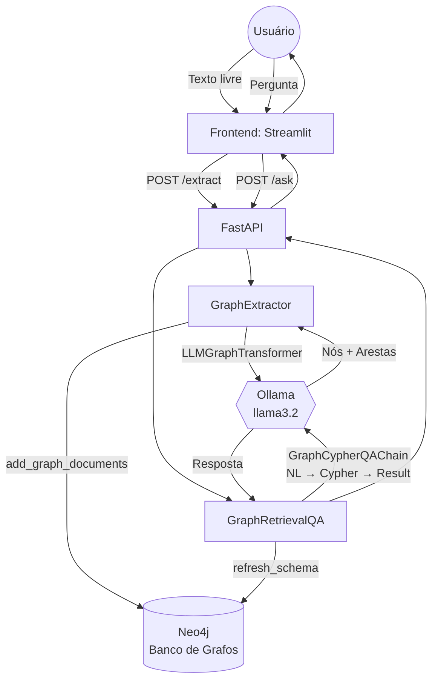

# PRJ-06_GraphRAG — Spec (SDD)

> **Padrão Oficial:** BMAD + SDD + TDD  
> **Última Atualização:** 2026-05-24  
> **Status:** ✅ Concluído | **Jira:** GARE-67

---

## 1. 🏗️ BMAD (Baseline Architecture)

*Extração de Grafo de Conhecimento + QA via Cypher sobre Neo4j.*

---

## 2. 📝 SDD (Spec-Driven Development)

### Objetivo Principal
Transformar texto livre em um **grafo de conhecimento** no Neo4j, com nós e arestas semânticas. Permite consultas em linguagem natural que são convertidas automaticamente em **queries Cypher** pelo LLM. Diferencial: captura **relações entre entidades** que buscas vetoriais tradicionais não percebem.

### Módulos Essenciais

| Módulo | Responsabilidade |
|--------|-----------------|
| `graph_engine.py: GraphExtractor` | Converte texto → grafo via `LLMGraphTransformer`; salva no Neo4j |
| `graph_engine.py: GraphRetrievalQA` | NL → Cypher → Resultado via `GraphCypherQAChain` |
| `LLMGraphTransformer` | LangChain: extrai nós e arestas de documentos via LLM |
| `GraphCypherQAChain` | LangChain: 2 LLMs (cypher_llm + qa_llm) para geração e interpretação |

### Configurações (via `.env`)

| Variável | Padrão | Descrição |
|----------|--------|-----------|
| `ENGINE_MODEL_NAME` | `llama3.2:latest` | LLM para extração e Cypher |
| `OLLAMA_BASE_URL` | `http://localhost:11434` | Endpoint Ollama |
| `NEO4J_URI` | `bolt://localhost:7687` | Conexão Neo4j |
| `NEO4J_USERNAME` | `neo4j` | Usuário Neo4j |
| `NEO4J_PASSWORD` | `password123` | Senha Neo4j |

### Comportamento de Extração

1. Texto livre é encapsulado em `Document` LangChain
2. `LLMGraphTransformer` extrai `GraphDocument` com `nodes` e `relationships`
3. Cada nó recebe propriedade `name = node.id` se `name` ausente (garantia de compatibilidade com `GraphCypherQAChain`)
4. Documentos de grafo salvos via `Neo4jGraph.add_graph_documents()`

### Comportamento de QA

1. `refresh_schema()` atualiza o schema Neo4j antes de cada query (garante que o LLM conheça os nós mais recentes)
2. `GraphCypherQAChain` usa dois LLMs separados: um para gerar Cypher, outro para interpretar o resultado
3. `allow_dangerous_requests=True` necessário para queries Cypher dinâmicas
4. Fallback: *"Desculpe, não encontrei uma resposta baseada nas relações do grafo."*

### Guardrails

- **Neo4j Unavailable:** Ambas as classes verificam `self.graph is None` antes de qualquer operação; retornam mensagem de erro sem propagar exceção
- **Schema Refresh:** QA sempre atualiza schema antes de gerar Cypher (evita queries inválidas para nós recém-inseridos)
- **`name` Property Guarantee:** Extrator garante que todo nó tem `name` para compatibilidade com o QA chain

### Fluxo de Exceções

| Cenário | Comportamento |
|---------|---------------|
| Neo4j offline | `self.graph = None`; retorna string de erro formatada |
| Cypher inválido gerado | `except Exception` captura; retorna erro de travessia |
| Texto sem entidades | `graph_documents` vazio; `add_graph_documents([])` sem erro |

---

## 3. 🧪 TDD

| Teste | Critério |
|-------|----------|
| `test_neo4j_connection` | `Neo4jGraph` conecta sem exceção | `self.graph is not None` |
| `test_graph_extraction` | Texto com 2 entidades gera ≥ 2 nós no Neo4j |
| `test_node_name_property` | Todo nó extraído tem `properties["name"]` definido |
| `test_schema_refresh` | `get_schema()` retorna string não vazia após extração |
| `test_cypher_qa` | Pergunta sobre entidade extraída retorna resposta não vazia |
| `test_neo4j_unavailable` | Com `self.graph = None`, métodos retornam string de erro |
| `test_graph_doc_count` | `extract_and_store()` retorna string com contagem de documentos |

**Status:** ✅ Validado. Extração de grafo + QA Cypher operacionais sobre Neo4j local.
